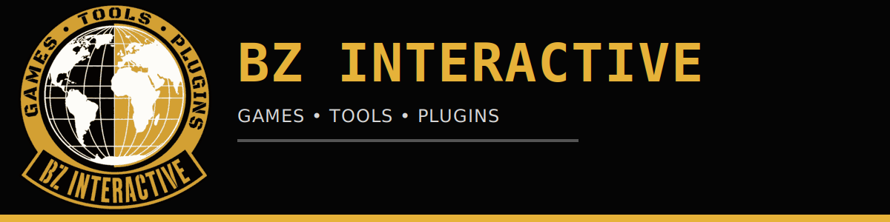
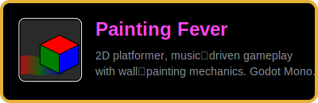
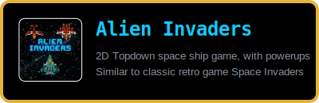
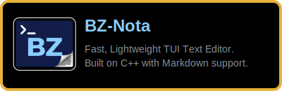
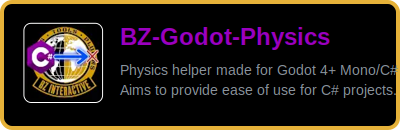
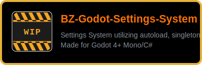

&nbsp;

## 🎮 Games

   
  <!--  
    -->

---

## 🔧 Tools

   

---

## 🔌 Plugins

    

---

## 👥 Team
<table width="100%" border="1" cellspacing="0" cellpadding="10" align="center">
  <tr>
    <td valign="top" align="center">
      <table border="0" cellpadding="0" cellspacing="0">
        <tr>
          <td valign="middle" style="padding-right: 10px;">
            
          </td>
          <td valign="middle">
            <h2 style="margin: 0;">Barkın Zorlu</h2>
            
Owner, Lead Developer

          </td>
        </tr>
      </table>
      

      

         
        
      

      

         
        
      

      

         
        
      

    </td>
    <td valign="top" align="center">
      <table border="0" cellpadding="0" cellspacing="0">
        <tr>
          <td valign="middle" style="padding-right: 10px;">
            
          </td>
          <td valign="middle">
            <h2 style="margin: 0;">Deniz Yılmaz</h2>
            
Developer

          </td>
        </tr>
      </table>
      

      

         
        
      

      

         
        
      

    </td>
    <td valign="top" align="center">
      <table border="0" cellpadding="0" cellspacing="0">
        <tr>
          <td valign="middle" style="padding-right: 10px;">
            
          </td>
          <td valign="middle">
            <h2 style="margin: 0;">Gökhan İrtem</h2>
            
Designer

          </td>
        </tr>
      </table>
      

      

         
        
      

      

         
        
    </td>
  </tr>
</table>

---

## 📬 Contact

<td valign="top">
  

    
  

  

    
  

  

    
  

</td>

---

## Contributing

All repositories are open to contributions. Browse a repo, read its `README.md`, open an issue to discuss your idea or fix, then submit a PR. No contribution is too small — bug fixes, docs, and new features are all welcome.

---

BZ-Interactive · Open Source · MIT License

