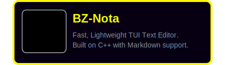
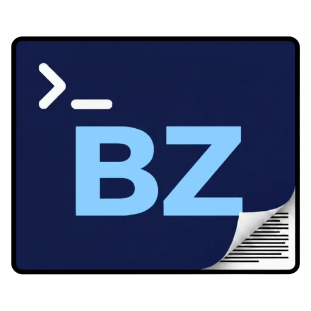

# BZ-Interactive
### Open-Source Games & Applications
*Built with C++, C# and Godot — everything in public.*

 

---

## 🎮 Games

  <table border="0" cellpadding="0" cellspacing="15" style="border: none; border-collapse: collapse; width: 100%; max-width: 900px; table-layout: fixed;">
    <tr>
      <td></td>
      <td></td>
    </tr>
    </tr>
      <td></td>
      <td></td>
    </tr>
    <!-- <tr>
      <td></td>
      <td></td>
      <td></td>
      <td></td>
    </tr> -->
    </table>

  <table style="table-layout: fixed; width: 80%; border-collapse: separate; border-spacing: 15px 15px;">
    <tr>
      <td valign="top" style="border: 5px solid #f2ff00; border-radius: 10px; padding: 20px;">
        <a href="https://github.com/BZ-Interactive/game-one">
          
          <strong>BZ-Nota</strong> 
          Fast Lightweight, TUI Text Editor. 
          built on C++ with Markdown support.
        </a>
      </td>
      <!-- <td width="2%"></td> -->
      <td valign="top" style="border: 1px solid #30363d; border-radius: 10px; padding: 20px;">
        <a href="https://github.com/BZ-Interactive/game-one">
          
          <strong>BZ-Nota</strong> 
          Fast Lightweight, TUI Text Editor. 
          built on C++ with Markdown support.
        </a>
      </td>
    </tr>
    <tr height="20">
      <td></td>
    </tr>
    <tr>
      <td style="border: 2px solid #ffff00; border-radius: 10px; padding: 5px; background-color: #000000;" width="49%">
        <a href="https://github.com/BZ-Interactive/game-one">
          
          <strong>BZ-Nota</strong> 
          Fast Lightweight, TUI Text Editor. 
          built on C++ with Markdown support.
        </a>
      </td>
      <td width="2%"></td>
      <td style="border: 2px solid #ffff00; border-radius: 10px; padding: 5px; background-color: #000000;" width="49%">
        <a href="https://github.com/BZ-Interactive/game-one">
          
          <strong>BZ-Nota</strong> 
          Fast Lightweight, TUI Text Editor. 
          built on C++ with Markdown support.
        </a>
      </td>
    </tr>
  </table>

---

## 🖥️ Programs

<table>
  <tr>
    <td width="50%">
      <a href="https://github.com/BZ-Interactive/bz-toolkit">
        
        <strong>BZ Toolkit</strong> 
        Modular C++ utility library for devs.
      </a>
    </td>
    <td width="50%">
      <a href="https://github.com/BZ-Interactive/bz-launcher">
        
        <strong>BZ Launcher</strong> 
        C# app launcher for all BZ-Interactive titles.
      </a>
    </td>
  </tr>
  <tr>
    <td width="50%">
      <a href="https://github.com/BZ-Interactive/bz-editor">
        
        <strong>BZ Editor Tools</strong> 
        Custom Godot editor plugins and scripts.
      </a>
    </td>
    <td width="50%">
      <a href="https://github.com/BZ-Interactive/bz-builder">
        
        <strong>BZ Builder</strong> 
        CI/CD pipeline tooling for Godot projects.
      </a>
    </td>
  </tr>
</table>

---

## 🔌 Plugins

<table>
  <tr>
    <td>
      <a href="https://github.com/BZ-Interactive/plugin-one">
        
        <strong>BZ Audio Manager</strong> 
        Godot plugin for dynamic audio mixing.
      </a>
    </td>
    <td>
      <a href="https://github.com/BZ-Interactive/.github/main/assets/icons/plugin2.png">
        
        <strong>BZ Save System</strong> 
        Lightweight save/load plugin for Godot.
      </a>
    </td>
  </tr>
  <tr>
    <td>
      <a href="https://github.com/BZ-Interactive/plugin-three">
        
        <strong>BZ Input Mapper</strong> 
        Rebindable input system, controller support.
      </a>
    </td>
    <td> <!-- width="50%" -->
      <a href="https://github.com/BZ-Interactive/plugin-four">
        
        <strong>BZ UI Kit</strong> 
        Reusable Godot UI components and themes.
      </a>
    </td>
  </tr>
</table>

---

## 👥 Team
<table width="100%">
  <tr>
    <td valign="top">
      <h3>Barkın Zorlu</h3>
      <h4>Owner, Lead Developer</h4>
      <ul>
        <li><strong>Portfolio:</strong> <a href="https://github.com/BZ-Interactive">@BZ-Interactive</a></li>
        <li><strong>Resume:</strong> <a href="https://github.com/BZ-Interactive">@BZ-Interactive</a></li>
        <li><strong>GitHub:</strong> <a href="https://github.com/BZ-Interactive">@BZ-Interactive</a></li>
        <li><strong>Email:</strong> <a href="https://discord.gg/yourlink">Join the server</a></li>
      </ul>
    </td>
  </tr>
</table>

---

## 📬 Contact

<td valign="top">
  <h3>🌐 Connect with Us</h3>
  <ul>
    <li><strong>GitHub:</strong> <a href="https://github.com/BZ-Interactive">@BZ-Interactive</a></li>
    <li><strong>Discord:</strong> <a href="https://discord.gg/yourlink">Join the server</a></li>
    <li><strong>Website:</strong> <a href="https://bz-interactive.com">bz-interactive.com</a></li>
    <li><strong>Email:</strong> contact@bz-interactive.com</li>
  </ul>
</td>

---

## Contributing

All repositories are open to contributions. Browse a repo, read its `CONTRIBUTING.md`, open an issue to discuss your idea, then submit a PR. No contribution is too small — bug fixes, docs, and new features are all welcome.

---

© BZ-Interactive · Open Source · MIT License · Built with C++ and Godot

