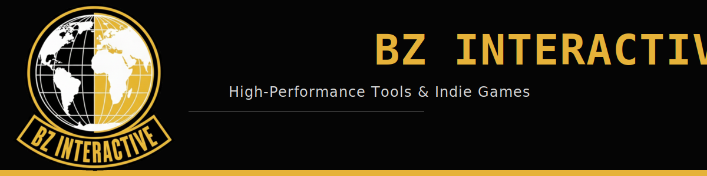

&nbsp;

 

---

## 🎮 Games

   
   
   

---

## 🔧 Tools

   

---

## 🔌 Plugins

    

---

## 👥 Team
<table width="100%" border="1" cellspacing="0" cellpadding="10" align="center"> <!-- Max limit is 3 STRICTLY -->
  <tr>
    <td valign="top"> <!-- width="50%" -->
      <table border="0" cellpadding="0" cellspacing="0">
        <tr>
          <td valign="middle" style="padding-right: 10px;">
            
          </td>
          <td valign="middle">
            <h3 style="margin: 0;">Barkın Zorlu</h3>
            
<strong>Owner, Lead Developer</strong>

          </td>
        </tr>
      </table>
      

      <ul style="list-style-type: none; padding-left: 0;">
        <li><strong>Portfolio:</strong> <a href="https://github.com/BZ-Interactive">@BZ-Interactive</a></li>
        <li><strong>Resume:</strong> <a href="https://github.com/BZ-Interactive">@BZ-Interactive</a></li>
        <li><strong>GitHub:</strong> <a href="https://github.com/ZorluBarkin">@ZorluBarkin</a></li>
        <!-- <li><strong>Matrix:</strong> <a href="https://discord.gg/yourlink">Join the server</a></li> -->
      </ul>
    </td>
    <td valign="top"> <!-- width="50%" -->
      <table border="0" cellpadding="0" cellspacing="0">
        <tr>
          <td valign="middle" style="padding-right: 10px;">
            
          </td>
          <td valign="middle">
            <h3 style="margin: 0;">Deniz Yılmaz</h3>
            
<strong>Developer</strong>

          </td>
        </tr>
      </table>
      

      <ul style="list-style-type: none; padding-left: 0;">
        <li><strong>Portfolio:</strong> <a href="https://github.com/BZ-Interactive">@BZ-Interactive</a></li>
        <li><strong>Resume:</strong> <a href="https://github.com/BZ-Interactive">@BZ-Interactive</a></li>
        <li><strong>GitHub:</strong> <a href="https://github.com/DeezYilmaz">@DenizYilmaz</a></li>
        <!-- <li><strong>Matrix:</strong> <a href="https://discord.gg/yourlink">Join the server</a></li> -->
      </ul>
    </td>
    <td valign="top"> <!-- width="50%" -->
      <table border="0" cellpadding="0" cellspacing="0">
        <tr>
          <td valign="middle" style="padding-right: 10px;">
            
          </td>
          <td valign="middle">
            <h3 style="margin: 0;">Unnamed</h3>
            
<strong>Designer</strong>

          </td>
        </tr>
      </table>
      

      <ul style="list-style-type: none; padding-left: 0;">
        <li><strong>Portfolio:</strong> <a href="https://github.com/BZ-Interactive">@BZ-Interactive</a></li>
        <li><strong>Resume:</strong> <a href="https://github.com/BZ-Interactive">@BZ-Interactive</a></li>
        <li><strong>GitHub:</strong> <a href="">@Someone</a></li>
        <!-- <li><strong>Matrix:</strong> <a href="https://discord.gg/yourlink">Join the server</a></li> -->
      </ul>
    </td>
  </tr>
</table>

---

## 📬 Contact

<td valign="top">
  <h3>🌐 Connect with Us</h3>
  <ul>
    <li><strong>GitHub:</strong> <a href="https://github.com/BZ-Interactive">@BZ-Interactive</a></li>
    <li><strong>Discord:</strong> <a href="https://discord.gg/yourlink">Join the server</a></li>
    <li><strong>Website:</strong> <a href="https://bz-interactive.com">bz-interactive.com</a></li>
    <li><strong>Email:</strong> contact@bz-interactive.com</li>
  </ul>
</td>

---

## Contributing

All repositories are open to contributions. Browse a repo, read its `CONTRIBUTING.md`, open an issue to discuss your idea, then submit a PR. No contribution is too small — bug fixes, docs, and new features are all welcome.

---

© BZ-Interactive · Open Source · MIT License · Built with C++ and Godot

